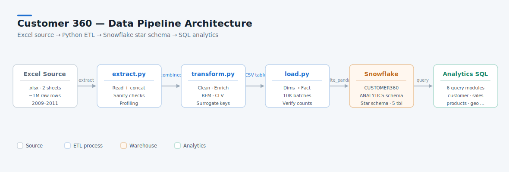
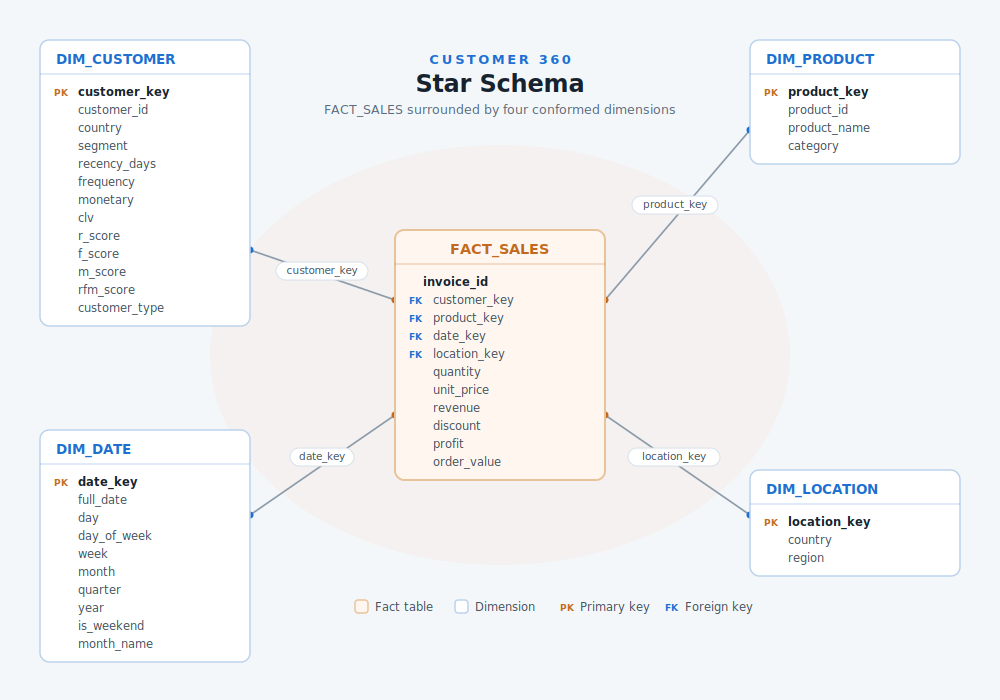

# Customer 360 Analytics Pipeline

An end-to-end data engineering and analytics project that transforms raw retail transaction data into a Snowflake data warehouse with a full SQL analytics layer for customer intelligence, sales performance, and product insights.

---

## Overview

This project ingests two years of UK online retail transactions (2009–2011), cleans and enriches the data with RFM scoring, CLV, and customer segmentation, loads it into a Snowflake star schema, and delivers a library of analytics SQL queries covering six business domains.

**Dataset:** [UCI Online Retail II](https://archive.ics.uci.edu/dataset/502/online+retail+ii) — ~1M raw transactions across 38 countries

**Final warehouse:**
| Table | Rows |
|---|---|
| FACT_SALES | 766,374 |
| DIM_CUSTOMER | 5,862 |
| DIM_PRODUCT | 4,625 |
| DIM_DATE | 604 |
| DIM_LOCATION | 41 |

---

## Architecture



### Star Schema



---

## Tech Stack

| Layer | Tools |
|---|---|
| Language | Python 3.11 |
| Data processing | pandas, numpy |
| Source ingestion | openpyxl |
| Warehouse | Snowflake |
| Snowflake driver | snowflake-connector-python, snowflake-sqlalchemy |
| Analytics | SQL (Snowflake dialect) |
| Logging | loguru |
| Config | PyYAML, python-dotenv |
| Progress | tqdm |

---

## Project Structure

```
customer_test/
├── etl/
│   ├── extract.py          # Reads Excel, concatenates sheets, saves raw_combined.csv
│   ├── transform.py        # Cleans data, computes RFM, builds dimension & fact tables
│   ├── load.py             # Loads CSVs into Snowflake (dims first, then fact)
│   └── utils.py            # Config loader, Snowflake connection, logger setup
│
├── config/
│   ├── config.yaml         # Snowflake connection + file paths (gitignored)
│   └── snowflake_schema.sql # DDL for all 5 tables
│
├── sql/
│   └── analytics/
│       ├── customer/       customer_analysis.sql
│       ├── retention/      retention_analysis.sql
│       ├── sales/          sales_analysis.sql
│       ├── products/       product_analysis.sql
│       ├── geography/      geography_analysis.sql
│       └── executive/      executive_summary.sql
│
├── data/
│   ├── raw/                online_retail_II.xlsx  (gitignored)
│   └── processed/          *.csv outputs          (gitignored)
│
├── docs/
├── logs/
├── requirements.txt
└── README.md
```

---

## Data Pipeline

### Phase 1 — Extract (`etl/extract.py`)

Reads both sheets from the Excel source file, concatenates them, runs sanity checks (date range, null counts, unique customer/product counts), and saves a `raw_combined.csv` checkpoint.

```bash
cd etl
python extract.py
```

### Phase 2 — Transform (`etl/transform.py`)

**Cleaning:**
- Drop rows with no Customer ID (guest checkouts)
- Remove cancelled invoices (Invoice starts with `C`) and negative quantities
- Filter invalid stock codes (`POST`, `D`, `M`, `BANK CHARGES`, `GIFT*`, etc.)
- Deduplicate on `(Invoice, StockCode, Customer ID)`

**Enrichment:**
- `Revenue = Quantity × Price`
- `Profit = Revenue × 0.40` (assumed 40% margin)
- `OrderValue` = invoice-level revenue total

**RFM Scoring** (snapshot date: 2012-01-01):

| Metric | Definition | Score |
|---|---|---|
| Recency | Days since last purchase | 1–5 (5 = most recent) |
| Frequency | Unique invoices per customer | 1–5 (5 = most frequent) |
| Monetary | Total revenue per customer | 1–5 (5 = highest spend) |

**Customer Segmentation:**

| Segment | Rule |
|---|---|
| VIP | R ≥ 4 AND F ≥ 4 AND M ≥ 4 |
| Loyal | R ≥ 3 AND F ≥ 3 |
| New | R ≥ 4 AND F ≤ 2 |
| At Risk | R ≤ 2 AND F ≥ 3 |
| Lost | R = 1 |
| Potential | All others |

```bash
python transform.py
```

### Phase 3 — Load (`etl/load.py`)

Loads dimension and fact tables into Snowflake in dependency order (dimensions first) using `write_pandas` with 10K-row batch chunks. Truncates tables before each load for idempotency.

```bash
python load.py
```

---

## Schema

```sql
DIM_CUSTOMER  (customer_key, customer_id, country, segment, recency_days,
               frequency, monetary, clv, r_score, f_score, m_score,
               rfm_score, customer_type)

DIM_PRODUCT   (product_key, product_id, product_name, category)

DIM_DATE      (date_key, full_date, day, day_of_week, week, month,
               quarter, year, is_weekend, month_name)

DIM_LOCATION  (location_key, country, region)

FACT_SALES    (invoice_id, customer_key, product_key, date_key,
               location_key, quantity, unit_price, revenue,
               discount, profit, order_value)
```

`FACT_SALES` is clustered on `(date_key, customer_key)` for query performance.

---

## Analytics SQL — Phase 4

Six SQL files covering all analytics domains. Each file answers multiple business questions using window functions, CTEs, and Snowflake-native functions.

### `customer/customer_analysis.sql`
- Top 10 customers by revenue
- RFM segmentation recomputed from transactions using `NTILE(5)`
- Segment distribution with revenue share
- CLV quartile tiers using `NTILE(4)` + cumulative window sums
- New vs Returning customer revenue split
- Churn risk classification by recency band
- High-value customers currently at churn risk

### `retention/retention_analysis.sql`
- Monthly cohort retention table (`DATE_TRUNC` + self-join)
- M1 / M3 / M6 / M12 retention rates per cohort
- Repeat purchase rate
- Average days between orders by segment (`LAG` on purchase dates)
- Customer lifespan (first to last purchase)
- Monthly new vs returning customer counts

### `sales/sales_analysis.sql`
- Monthly revenue with MoM and YoY growth (`LAG` / `LEAD`)
- Annual revenue summary with YoY comparison
- Quarterly revenue breakdown with % of annual
- Revenue by day of week
- Weekday vs weekend revenue split
- Top 10 highest revenue days
- Rolling 3-month average revenue

### `products/product_analysis.sql`
- Top 10 products by revenue
- Top 10 products by units sold
- Pareto analysis — products driving 80% of revenue (`RANK` + cumulative %)
- Category performance summary
- Top product per category
- Monthly revenue trend per category with MoM delta
- Products with the widest customer reach

### `geography/geography_analysis.sql`
- Revenue by region with share %
- Revenue by country with global and regional ranking
- Top 10 markets
- Customer segment distribution by region
- Monthly revenue trend by region with MoM delta
- Average order value by country (min 10 orders)

### `executive/executive_summary.sql`
- Overall business KPIs (orders, customers, products, markets, revenue, profit)
- Annual KPIs with YoY revenue and customer growth
- Customer segment health snapshot
- Top-performing region, segment, and category in one view
- Monthly revenue run-rate vs prior year
- Churn risk exposure — revenue at risk by status

---

## Setup

### 1. Clone the repository

```bash
git clone <repo-url>
cd customer_test
```

### 2. Create a virtual environment

```bash
python -m venv venv
source venv/bin/activate        # Windows: venv\Scripts\activate
pip install -r requirements.txt
```

### 3. Configure Snowflake credentials

Create `config/config.yaml` from the template below. This file is gitignored — never commit credentials.

```yaml
snowflake:
  account: "your-account-id"
  user: "your-username"
  password: "your-password"
  role: "SYSADMIN"
  warehouse: "COMPUTE_WH"
  database: "CUSTOMER360"
  schema: "ANALYTICS"

paths:
  raw_data: "data/raw/online_retail_II.xlsx"
  processed_dir: "data/processed/"

etl:
  batch_size: 10000
  log_level: "INFO"
```

### 4. Create the Snowflake schema

Run the DDL against your Snowflake instance before loading data:

```sql
-- Run config/snowflake_schema.sql in a Snowflake worksheet
```

### 5. Add the source data

Download [Online Retail II](https://archive.ics.uci.edu/dataset/502/online+retail+ii) and place it at:

```
data/raw/online_retail_II.xlsx
```

### 6. Run the pipeline

```bash
cd etl
python extract.py
python transform.py
python load.py
```

Logs are written to `logs/` with a timestamp in the filename.

---

## Key Metrics (2009–2011)

| Metric | Value |
|---|---|
| Total revenue | ~£9.7M |
| Total orders | 22,190 |
| Total customers | 5,862 |
| Total products | 4,625 |
| Markets | 41 countries |
| Top market | United Kingdom |
| Data period | Dec 2009 – Dec 2011 |

---

## Roadmap

- [x] Phase 1 — Project setup and data sourcing
- [x] Phase 2 — ETL pipeline (extract, transform, load)
- [x] Phase 3 — Snowflake star schema
- [x] Phase 4 — Analytics SQL layer
- [ ] Phase 5 — Dashboard (Tableau / Power BI)

---

## Notes

- The dataset contains no discount data; the `discount` column in `FACT_SALES` is a placeholder (all zeros) for schema completeness.
- Profit margin is assumed at 40% as cost data is not available in the source.
- RFM snapshot date is `2012-01-01` (one day after the last transaction in the dataset).
- Cancelled invoices (prefix `C`) and guest checkouts (no Customer ID) are excluded from all analysis.
